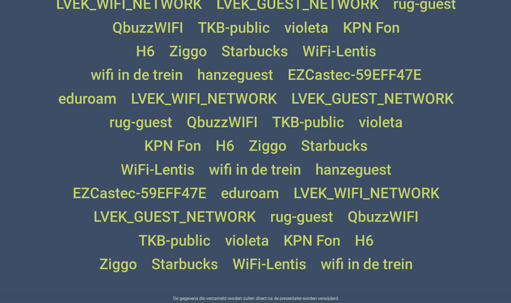

# Word cloud Representation of Wifi Probes

This tool provides a live word cloud of wifi probes collected by aircrack-ng. It is a webpage that can be rendered for presentations in full screen in browsers. It can also be embedded in presentations.

## Screenshot

## Privacy

This tool will not store any data on the long run, other than temporary for showing the word cloud.

## How to install

Clone this repository.

``git clone ... ``

``npm install``

## How to run

Find yoir wireless network interface name using `ifconfig`. In this example, the interface name is `wlxe894f61c0f5a`.

Start the monitoring of the interface.
``sudo airmon-ng start wlxe894f61c0f5a 1``

``sudo airodump-ng mon0``

Start the webserver.
``node server.js``

## How to embed in PowerPoint

